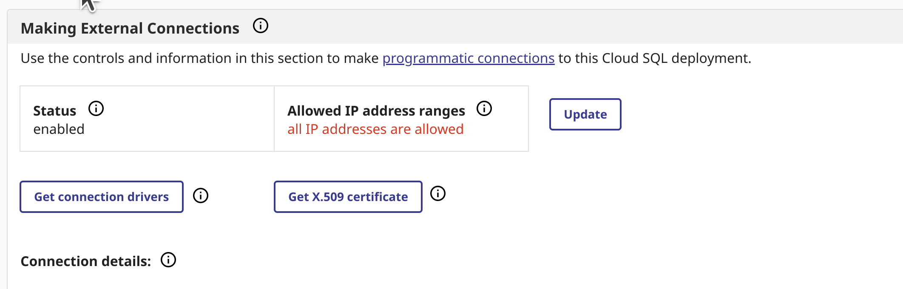
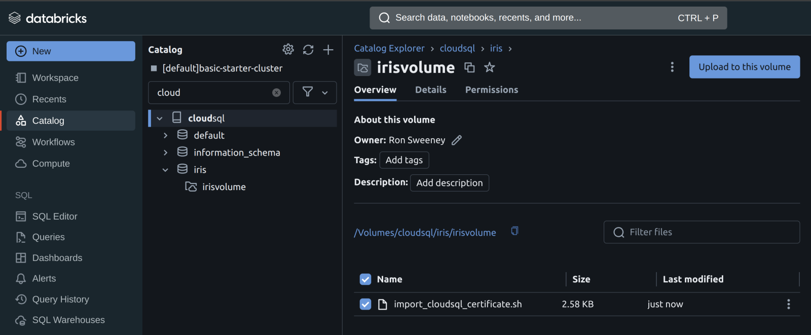
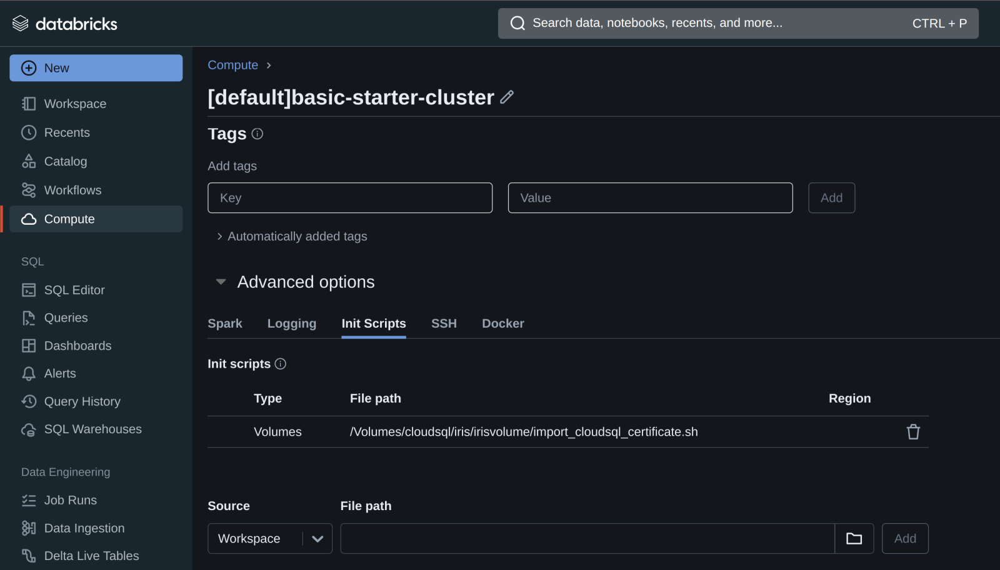
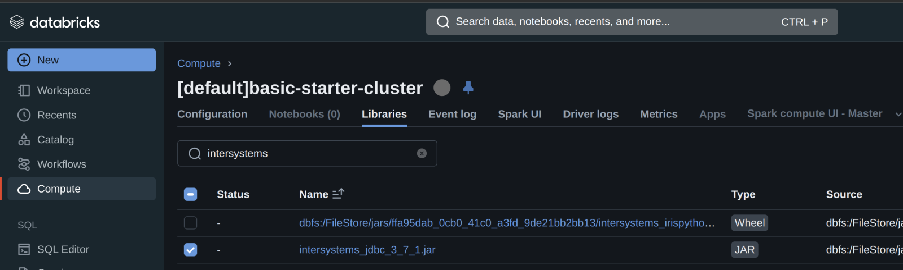
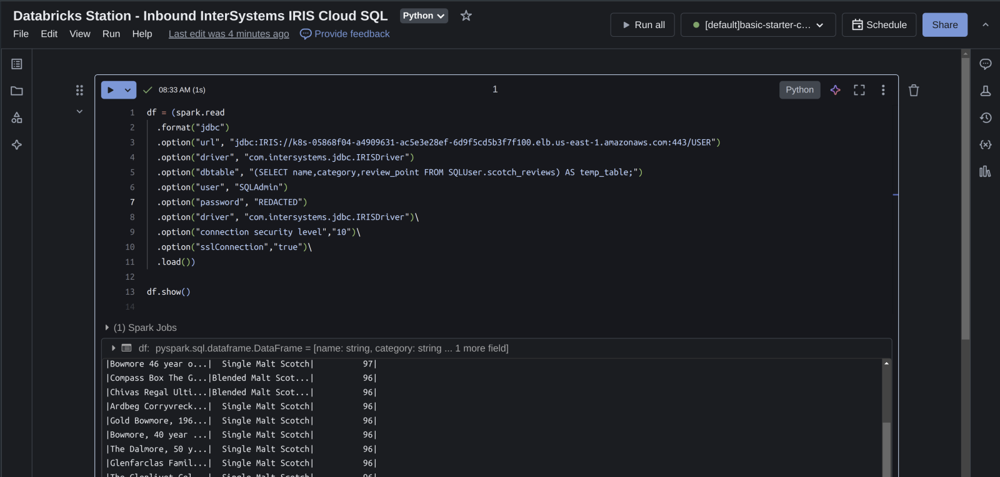
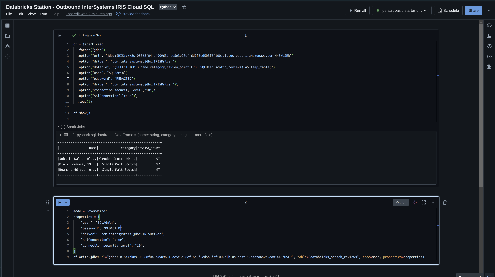
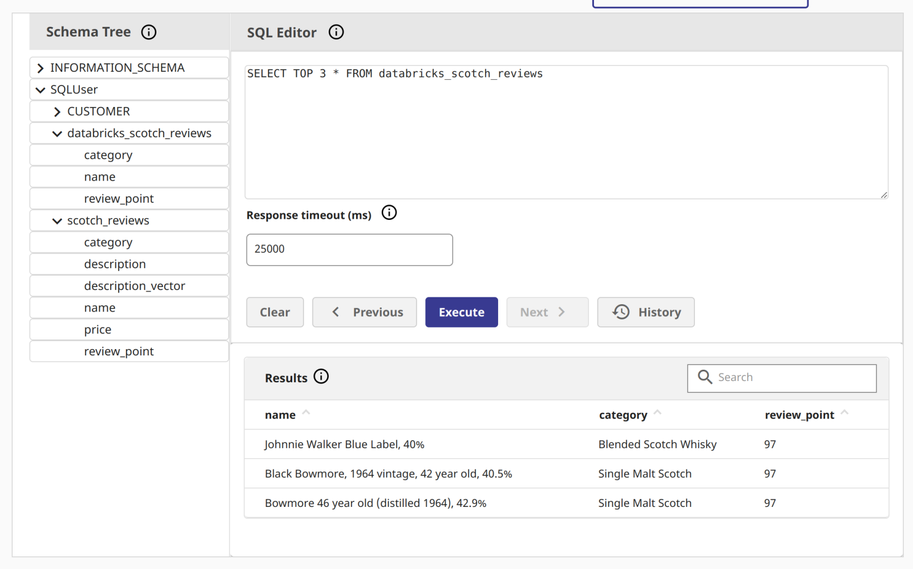

# Databricks Station - InterSystems Cloud SQL
A Quick Start to InterSystems Cloud SQL Data in Databricks
--

Up and Running in Databricks against an InterSystmes Cloud SQL consists of four parts.

- Obtaining Certificate and JDBC Driver for InterSystems IRIS
- Adding an init script and external library to your Databricks Compute Cluster
- Getting Data
- Putting Data
 

### Download X.509 Certificate/JDBC Driver from Cloud SQL
Navigate to the overview page of your deployment, if you do not have external connections enabled, do so and download your certificate and the jdbc driver from the overview page.



I have used intersystems-jdbc-3.8.4.jar and intersystems-jdbc-3.7.1.jar with success in Databricks from Driver Distribution.

### Init Script for your Databricks Cluster
Easiest way to import one or more custom CA certificates to your Databricks Cluster, you can create an init script that adds the entire CA certificate chain to both the Linux SSL and Java default cert stores, and sets the REQUESTS_CA_BUNDLE property. Paste the contents of your downloaded X.509 certificate in the top block of the following script:

import_cloudsql_certficiate.sh

```
#!/bin/bash

cat << 'EOF' > /usr/local/share/ca-certificates/cloudsql.crt
-----BEGIN CERTIFICATE-----
<PASTE>
-----END CERTIFICATE-----
EOF

update-ca-certificates

PEM_FILE="/etc/ssl/certs/cloudsql.pem"
PASSWORD="changeit"
JAVA_HOME=$(readlink -f /usr/bin/java | sed "s:bin/java::")
KEYSTORE="$JAVA_HOME/lib/security/cacerts"
CERTS=$(grep 'END CERTIFICATE' $PEM_FILE| wc -l)

# To process multiple certs with keytool, you need to extract
# each one from the PEM file and import it into the Java KeyStore.
for N in $(seq 0 $(($CERTS - 1))); do
  ALIAS="$(basename $PEM_FILE)-$N"
  echo "Adding to keystore with alias:$ALIAS"
  cat $PEM_FILE |
    awk "n==$N { print }; /END CERTIFICATE/ { n++ }" |
    keytool -noprompt -import -trustcacerts \
            -alias $ALIAS -keystore $KEYSTORE -storepass $PASSWORD
done
echo "export REQUESTS_CA_BUNDLE=/etc/ssl/certs/ca-certificates.crt" >> /databricks/spark/conf/spark-env.sh
echo "export SSL_CERT_FILE=/etc/ssl/certs/ca-certificates.crt" >> /databricks/spark/conf/spark-env.sh
```

Now that you have the init script, upload the script to Unity Catalog to a Volume.



Once the script is on a volume, you can add the init script to the cluster from the volume in the Advanced Properties of your cluster.



Secondly, add the intersystems jdbc driver/library to the cluster...



...and either start or restart your compute.

## Databricks Station - Inbound InterSystems IRIS Cloud SQL


Create a Python Notebook in your workspace, attach it to your cluster and test dragging data inbound to Databricks.  Under the hood, Databricks is going to be using pySpark, if that is not immediately obvious.

The following spark dataframe construction is all you should need, you can grab your connection info from the overview page as before.


```
df = (spark.read
  .format("jdbc")
  .option("url", "jdbc:IRIS://k8s-05868f04-a4909631-ac5e3e28ef-6d9f5cd5b3f7f100.elb.us-east-1.amazonaws.com:443/USER")
  .option("driver", "com.intersystems.jdbc.IRISDriver")
  .option("dbtable", "(SELECT name,category,review_point FROM SQLUser.scotch_reviews) AS temp_table;") 
  .option("user", "SQLAdmin")
  .option("password", "REDACTED")
  .option("driver", "com.intersystems.jdbc.IRISDriver")\
  .option("connection security level","10")\
  .option("sslConnection","true")\
  .load())

df.show()
```

Illustrating the dataframe output from data in Cloud SQL... boom!



## Databricks Station - Outbound InterSystems IRIS Cloud SQL


Lets now take what we read from IRIS and write it write back with Databricks. If you recall we read only 3 fields into our dataframe, so lets write that back immediately and specify an "overwrite" mode.

```
df = (spark.read
  .format("jdbc")
  .option("url", "jdbc:IRIS://k8s-05868f04-a4909631-ac5e3e28ef-6d9f5cd5b3f7f100.elb.us-east-1.amazonaws.com:443/USER")
  .option("driver", "com.intersystems.jdbc.IRISDriver")
  .option("dbtable", "(SELECT TOP 3 name,category,review_point FROM SQLUser.scotch_reviews) AS temp_table;") 
  .option("user", "SQLAdmin")
  .option("password", "REDACTED")
  .option("driver", "com.intersystems.jdbc.IRISDriver")\
  .option("connection security level","10")\
  .option("sslConnection","true")\
  .load())

df.show()

mode = "overwrite"
properties = {
    "user": "SQLAdmin",
    "password": "REDACTED",
    "driver": "com.intersystems.jdbc.IRISDriver",
    "sslConnection": "true",
    "connection security level": "10",
}

df.write.jdbc(url="jdbc:IRIS://k8s-05868f04-a4909631-ac5e3e28ef-6d9f5cd5b3f7f100.elb.us-east-1.amazonaws.com:443/USER", table="databricks_scotch_reviews", mode=mode, properties=properties)
```

### Executing the Notebook


 
Illustrating the data in InterSystems Cloud SQL!




### Things to Consider

- By default, PySpark writes data using multiple concurrent tasks, which can result in partial writes if one of the tasks fails.  
- To ensure that the write operation is atomic and consistent, you can configure PySpark to write data using a single task (i.e., set the number of partitions to 1) or use a iris-specific feature like transactions.  
- Additionally, you can use PySpark’s DataFrame API to perform filtering and aggregation operations before reading the data from the database, which can reduce the amount of data that needs to be transferred over the network.  
